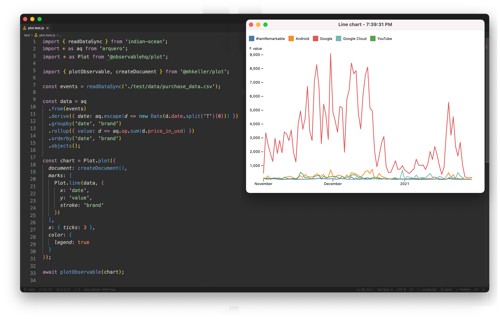

Plot
===

> A small node library to display charts in popup windows and save them as pngs. Supports [Observablehq/plot](https://observablehq.com/@observablehq/plot), [Vega-lite](https://vega.github.io/vega-lite/), [Vega-lite-api](https://vega.github.io/vega-lite-api/) and [Plotly](https://plotly.com/javascript/) out of the box.

- [Motivation](#motivation)
- [Installing](#installing)
- [Plotting Vega-Lite charts](#plotting-vega-lite-charts)
- [Plotting Observablehq/plot charts](#plotting-observablehqplot-charts)
- [Plotting histograms](#plotting-histograms)
- [Generic plotting](#generic-plotting)
- [Examples](#examples)
- [A note on `undefined` variables](#a-note-on-undefined-variables)
- [How it works](#how-it-works)

## Motivation

In notebook-based systems or IDEs like RStudio, it's nice to create a quick chart or map from your data. There aren't that many similar solutions for Node.js, however. This library is a small bridge that allows you to take advantage of these or similar charting libraries such as [observablehq/plot](https://observablehq.com/@observablehq/plot), [vega-lite](https://vega.github.io/vega-lite/), [vega-lite-api](https://vega.github.io/vega-lite-api/) and [plotly](https://plotly.com/javascript/) or others to renders charts in a browser environment directly from a Node script, see the results in a minimal popup window and save the image.


**Vega example**


**Observablehq/plot example**



**Histogram example**


**Plotly (choropleth map) example**


## Installing

```
npm install @mhkeller/plot
```

## Plotting Vega-Lite charts

**plotVega(** `chartConfig: Object, options: Object` **)**

*Arguments*

* **chartConfig** `{Object}` **(required)**
  * A Vega-Lite-API chart or a Vega-Lite spec..
* **options** `{Object}`
  * An options object.
* **options.outPath** `{String='chart.png'}`
  * A filepath to write the image.
* **options.view** `{Boolean=true}`
  * If true, show the chart in a popup window.
* **options.title** `{String='Chart'}`
  * If `view` is true, add a title to the window's page. A timestamp will be appended to this.
* **options.css** `{String}`
  * Any CSS that you want injected into the page to tweak styles.
* **options.debug** `{Boolean = false}`
  * Whether to run the screenshot browser in headfull mode.

```js
import { plotVega } from '@mhkeller/plot'
import * as vl from 'vega-lite-api';

const data = [
  { category: 'A', value: 28 },
  { category: 'B', value: 55 },
  { category: 'C', value: 43 },
  { category: 'D', value: 91 },
];

const chart = vl
  .markBar()
  .description('A simple bar chart.')
  .data(data)
  .encode(
    vl.x().fieldO('category'),
    vl.y().fieldQ('value')
  );

await plotVega(chart);
```

You can also supply a Vega-Lite JSON spec:

```js
import { plotVega } from '@mhkeller/plot'

const data = {
  values: [
    { category: 'A', value: 28 },
    { category: 'B', value: 55 },
    { category: 'C', value: 43 },
    { category: 'D', value: 91 },
  ]
};

const spec = {
  $schema: 'https://vega.github.io/schema/vega-lite/v5.json',
  description: 'A simple bar chart.',
  data,
  mark: 'bar',
  encoding: {
    x: { field: 'category', type: 'ordinal' },
    y: { field: 'value', type: 'quantitative' }
  }
};

await plotVega(spec);
```

## Plotting Observablehq/plot charts

> Note: You have to pass in a `document` element using the exported `createDocument` function. See the example below.

**plotObservable(** `chart: Function, data: Array, options: Object` **)**

*Arguments*

* **chart** `{Function}` **required**
  * An @observablehq/plot function. The first argument should be your dataset.
* **data** `Array` **required**
  * The data to pass in to the chart function.
* **options** `{Object}`
  * An options object.
* **options.outPath** `{String='chart.png'}`
  * A filepath to write the image.
* **options.view** `{Boolean=true}`
  * If true, show the chart in a popup window.
* **options.title** `{String='Chart'}`
  * If `view` is true, add a title to the window's page. A timestamp will be appended to this.
* **options.css** `{String}`
  * Any CSS that you want injected into the page to tweak styles.
* **options.debug** `{Boolean = false}`
  * Whether to run the screenshot browser in headfull mode.

```js
import { readDataSync } from 'indian-ocean';
import * as aq from 'arquero';

import { plotObservable, createDocument } from '@mhkeller/plot';

const events = readDataSync('./test/data/purchase_data.csv');

const data = aq
  .from(events)
  .derive({ date: aq.escape(d => new Date(d.date.split('T')[0])) })
  .groupby('date', 'brand')
  .rollup({ value: d => aq.op.sum(d.price_in_usd) })
  .orderby('date', 'brand')
  .objects();

const chart = Plot.plot({
  document: createDocument(),
  marks: [
    Plot.line(data, {
      x: 'date',
      y: 'value',
      stroke: 'brand'
    })
  ],
  color: {
    legend: true
  }
});

await plotObservable(chart);
```

## Plotting histograms

**plotHistogram(** `data: Array, { facetBy: String[], fields: String{}, outDir: String[, name: String, fill: String='#000', css: String, view: false] } }` **)**

A more specific function that takes data, a list of fields to facet by and a list of fields to compute values for. Writes a screenshot.

```javascript
import { plotHistogram } from '@mhkeller/plot`;

plotHistogram(data, { 
 facetBy: ['group'], 
 fields: ['value', 'value2'], 
 outDir: 'out_images', 
 name: 'my-charts', 
 fill: 'group', 
 view: true
});
```

*Arguments*

* **data** `{Array}` **(required)**
  * Your data to render. 
* **options** `{Object}`
  * An options object. 
* **options.facetBy** `{String[]}`**(required)**
  * An array of field names to facet by. These facets are not combined, it's just a shorthand for running multiple facets at a time, done separately in succession. 
* **options.fields** `{String[]}` **(required)**
  * An array of fields to compute histogram values for. 
* **options.outDir** `{String}` **(required)**
  * The *directory* – not a specific file name – to write the various files out to. 
  * Filenames are generated according to the convention: 
    * With a `name` supplied: `${name}_by__${facet}_${field}.png`;
    * With no `name` supplied: `by__${facet}_${field}.png`;
    * If `breakoutFields=false` `_${field}` is a concatenation of all fields separated by a `|` character.
    * If `columns=false`, the file name will end in `_lines.png`.
* **options.fill** `{String}`
  * A hex code or field name. Defaults to `'#000'`.
* **options.view** `{Boolean=true}`
  * If true, show the chart in a popup window.
* **options.css** `{String}`
  * Any CSS that you want injected into the page to tweak styles.
* **options.breakoutFields** `{Boolean=true}`
  * For each field passed into `options.fields` write out a separate PNG. Set this to false to put everything on the same scale.
* **options.columns** `{Boolean=true}`
  * Draw the histogram as columns, like a regular histogram. If this is `false`, just draw semi-opaque lines, which can be useful for seeing density.
* **options.debug** `{Boolean = false}`
  * Whether to run the screenshot browser in headfull mode.

## Generic plotting

**plot(** `plotFunction: Function, args: Array, options: Object` **)**

A generic function to render HTML, view and screenshot it. 

If your plot function requires a DOM element ID to render into (as Plotly does), a `#body` element is added to the page for you to use.

The `plotFunction` can return data specific to the chart library you're using:

* Vega-lite: Return the JSON spec, it will be passed to `vegaEmbed`.
* Vega-lite-api: Return the chart object. It will be called with `toSpec()` and then passed to `vegaEmbed`.
* ObservableHq/Plot: Return the chart object. It will be called and the HTML will be appended to the 

```javascript
import { plot } from '@mhkeller/plot';

const dataset = {
  values: [
    { a: 'A', b: 28 },
    { a: 'B', b: 55 },
    { a: 'C', b: 43 },
    { a: 'D', b: 91 },
  ]
};

const chart = data => {
  return {
    $schema: 'https://vega.github.io/schema/vega-lite/v5.json',
    description: 'A simple bar chart with embedded data.',
    data,
    mark: 'bar',
    encoding: {
      x: {field: 'a', type: 'ordinal'},
      y: {field: 'b', type: 'quantitative'}
    }
  };
}

// Or, if using vega-lite-api
const chart = data => {
  return vl.markBar()
    .description('A simple bar chart with embedded data.')
    .data(data)
    .encode(
      vl.x().fieldO('a'),
      vl.y().fieldQ('b')
    )
}

await plot(chart, [dataset], {
  library: 'vega-lite',
  // library: 'vega-lite-api',
  view: true,
  title: 'Vega line chart'
  outPath: 'test/tmp/vega-lite_line-plot.png',
});
```

If the plot function simply creates HTML, then this function can simply return from that function and the HTML will be appended to the `#body` element automatically such as in this Observablehq/plot example.

```javascript
import { plot } from '@mhkeller/plot`;

const dataset = /* read in your dataset ... */

// Create a function that returns html
const chart = data => {
  return Plot.plot({
    marks: [
      Plot.rectY(
        data, 
        Plot.binX(
          { y: 'count' }, 
          {
            x: 'date', 
            y: 'value', 
            fill: 'blue', 
            thresholds: 10
          }
        )
      )
    ]
  });
}

await plot(chart, [data], { 
 outPath: 'chart.png',
 view: true,
 library: 'observablehq/plot' // default
});
```

*Note: If your plot function requires a DOM element ID to render into, a `#body` element is added to the page for you to use.*

*Arguments*

* **chart** `{Function}` **(required)**
  * A function that accepts a dataset and returns a function that renders a chart. 
* **arguments** `{Function}` **(required)**
  * An array of arguments that go into your chart function. This will be the data plus any others you may need. 
* **options** `{Object}`
  * An options object.
* **options.library** `{String|String[]='observablehq/plot'}`
  * Specify what library to load to render the plot. Built-in options are `'observablehq/plot'`, `'vega-lite'`, `'vega-lite-api'` and `'plotly'`. Other strings will be interpreted as custom JavaScript to insert. This field can also be an array of strings, if you need to add multiple scripts.
* **options.outPath** `{String='chart.png'}`
  * A filepath to write the image.
* **options.view** `{Boolean=true}`
  * If true, show the chart in a popup window.
* **options.title** `{String='My chart'}`
  * If `view` is true, add a title to the window's page. A timestamp will be appended to this.
* **options.css** `{String}`
  * Any CSS that you want injected into the page to tweak styles.
* **options.debug** `{Boolean = false}`
  * Whether to run the screenshot browser in headfull mode.

## Examples

See the [test](./test/) folder for more.

## A note on `undefined` variables

Because the chart plotting function only gets executed in the browser context, it may reference global variables that don't exist in your node context. In some of the examples above, your linter may flag `Plotly` and `Plot` (from @observablehq/plot) as missing. But don't worry, those variables will exist at runtime and you can ignore these warnings.

## How it works

The library's `plot` function takes the code inside the `chart` function and executes it inside a Chrome window controlled by [playwright](https://github.com/microsoft/playwright/). It's essentially a wrapper around running [`page.evaluate`](https://playwright.dev/docs/evaluating) that also injects the required JavaScript libraries needed to render the code. But it's also a bit fancier.

To have better usability, the library renders your chart twice: Once in a hidden browser window to get the screenshot and a second time in a chromeless window for display. The first render is used to measure the dimensions of the generated chart. Those bounds are then passed to the second render so the display can be sized appropriately. Otherwise, you would see a flicker of resizing. 
